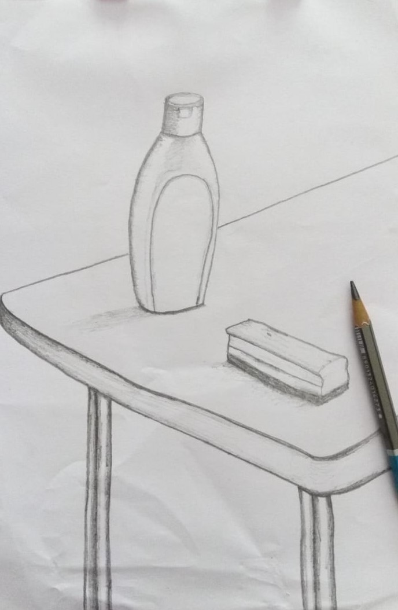

## Welcome to Adil khan Portfolio


### My Blender Work [More Works Inside!](https://github.com/adilblender/Portfolio/tree/main/blenderWork/blenderImages)


### Sketching [More Works Inside!](https://github.com/adilblender/Portfolio/blob/main/Drawing)





### My Unity Work
 ## Unity Script for Simple Camera Movement on X Z axis for a 2.5D game
```markdown

using System.Collections;
using System.Collections.Generic;
using UnityEngine;

public class moveWithArrow : MonoBehaviour
{
    // Start is called before the first frame update
    void Start()
    {
        
    }

    // Update is called once per frame
    void Update()
    {
        if (Input.GetKey("up"))
        {
          
           transform.position = transform.position + new Vector3(-1f, 0f, -1f);
        }

        if (Input.GetKey("down"))
        {
            
            transform.position = transform.position + new Vector3(1f, 0f, 1f);
        }
        if (Input.GetKey("right"))
        {
            
            transform.position = transform.position + new Vector3(-1f, 0f, 1f);
        }
        if (Input.GetKey("left"))
        {
            
            transform.position = transform.position + new Vector3(1f, 0f, -1f);
        }

    }
}

```


<!---You can use the [editor on GitHub](https://github.com/adilblender/Portfolio/edit/main/README.md) to maintain and preview the content for your website in Markdown files.

Whenever you commit to this repository, GitHub Pages will run [Jekyll](https://jekyllrb.com/) to rebuild the pages in your site, from the content in your Markdown files.

### Markdown

Markdown is a lightweight and easy-to-use syntax for styling your writing. It includes conventions for--->

```markdown
Syntax highlighted code block

# Header 1
## Header 2
### Header 3

- Bulleted
- List

1. Numbered
2. List

**Bold** and _Italic_ and `Code` text

[Link](url) and 
```

For more details see [GitHub Flavored Markdown](https://guides.github.com/features/mastering-markdown/).

### Jekyll Themes

Your Pages site will use the layout and styles from the Jekyll theme you have selected in your [repository settings](https://github.com/adilblender/Portfolio/settings/pages). The name of this theme is saved in the Jekyll `_config.yml` configuration file.

### Support or Contact

Having trouble with Pages? Check out our [documentation](https://docs.github.com/categories/github-pages-basics/) or [contact support](https://support.github.com/contact) and we’ll help you sort it out.
